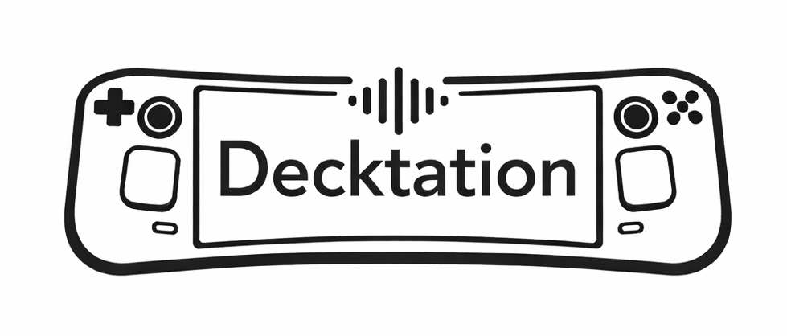

<p align="center">
  
</p>

# Decktation - Push-to-Talk Dictation for Steam Deck

Voice dictation plugin for Steam Deck using faster-whisper with context-aware transcription.

## Features

- **Push-to-Talk**: Hold button combo (default: L1+R1) to record
- **Configurable buttons**: Choose 1-5 button combinations from any Steam Deck controller buttons
- **Game presets**: Switch between game profiles with different chat systems (WoW, Generic)
- **Channel-aware**: Speak channel prefixes like "party pull boss" and it routes to the right chat channel
- **Test Recording**: Built-in 3-second test with automatic transcription display
- **Context-aware**: Optional WoW addon integration for better accuracy with zone, boss, and party context
- **Fast transcription**: Uses faster-whisper for efficient CPU-based speech recognition
- **Auto-type**: Automatically types transcribed text into active window via ydotool
- **Toast notifications**: Optional notifications when recording starts/stops

## Installation

1. Download `decktation.zip` from [GitHub Releases](https://github.com/silverfoxy/decktation/releases)

2. Extract and install:
   ```bash
   unzip decktation.zip
   sudo cp -r decktation /home/deck/homebrew/plugins/
   ```

3. Setup keyboard simulation (one-time):
   ```bash
   sudo /home/deck/homebrew/plugins/decktation/setup_ydotoold.sh
   ```

4. Restart Decky or reload plugins from Decky settings

All dependencies are pre-bundled in the release.

## Usage

1. Open Quick Access Menu (... button on Steam Deck)
2. Navigate to Decktation plugin
3. Select your game from the **Game** dropdown
4. Enable the plugin (waits for Whisper model to load)
5. (Optional) Change the button combination in the plugin UI
6. In any app/game: hold **[button1]+[button2]** together to record, release to transcribe and type

## Game Presets

Decktation ships with two presets configured in `game_presets.json`:

| Preset | Behavior |
|--------|----------|
| **World of Warcraft** | Presses Enter to open chat, types channel prefix + message, presses Enter to send |
| **Generic** | Types text directly into whatever window is focused — no Enter presses |

### WoW Channel Prefixes

In WoW mode, start your message with a channel name to route it to the right channel:

```
"party let's go"          →  /p let's go
"raid: focus adds first"  →  /raid focus adds first
"say, hello everyone"     →  /s hello everyone
"guild heads up"          →  /g heads up
"type search term"        →  types directly without opening chat
```

Separators supported: space, colon, comma, or period after the channel name. Case-insensitive.

Available WoW channels: `say`, `party`, `raid`, `guild`, `officer`, `yell`, `instance`, `whisper`, `type`

### Adding More Presets

Edit `game_presets.json` to add new games — no code changes needed. Each preset specifies:
- `chat_open_key` — key to open the chat box (`"enter"` or `null`)
- `chat_send_key` — key to send the message (`"enter"` or `null`)
- `default_channel` — channel to use when no prefix is spoken
- `channels` — map of spoken words to slash-command prefixes
- `whisper_prompt` — vocabulary hint for the Whisper model

## Button Configuration

The plugin uses a configurable button combo for push-to-talk. You can set 1–5 buttons from the plugin UI.

Available buttons:

- **L1, R1** (bumpers) — _Default combo_
- **L2, R2** (triggers)
- **L5, R5** (back grips) — note: intercepted by Steam in some modes
- **A, B, X, Y** (face buttons)

## Use Cases

### Gaming

- **WoW chat**: Dictate messages with correct channel routing (party, raid, guild, etc.)
- **Generic text input**: Type player names, search terms, chat in any game without a keyboard

### General

- **Web browsing**: Fill forms, search, comment
- **Discord/messaging**: Send messages hands-free
- **Any text input**: Works in any active window using the Generic preset

## WoW Context Support (Optional)

For improved accuracy with WoW-specific vocabulary, install the included WoW addon and run `convert_wow_context.py --watch`. It reads your current zone, target, party members, and class/spec from the game and feeds them to Whisper as context.

See `doc/TESTING_GUIDE.md` for setup instructions.

## Troubleshooting

### Plugin not showing up

- Check Decky Loader logs: `/tmp/decky-*.log`
- Ensure all Python dependencies are installed
- Restart Decky Loader

### Recording not working

- Ensure the plugin is enabled
- Check that Steam Deck mic is working (test in another app)
- Verify ydotoold is running: `pgrep ydotoold`
- Check logs: `/tmp/decktation.log`

### Button combo not detected

- Try a different button combination in the plugin UI
- Avoid L5/R5 as Steam may intercept these buttons
- Check `/tmp/decktation.log` for controller listener errors
- Verify controller listener is running: `pgrep -f controller_listener`

### Performance on Steam Deck

- Default `base` model is recommended (good balance)
- For faster: use `tiny` model (edit wow_voice_chat.py line 28)
- For accuracy: use `small` model (slower, needs more resources)

## Technical Details

- **Speech recognition**: faster-whisper (CTranslate2 backend)
- **Model**: base (150MB, ~2-4s transcription time)
- **Input**: Steam Deck microphone or connected headset
- **Controller input**: evdev (separate subprocess to avoid Steam interception)
- **Output**: Keyboard simulation via ydotool (bundled)
- **Game presets**: `game_presets.json` — data-driven, no code changes needed to add games
- **Dependencies**: Pre-bundled Python 3.11 libraries in `lib/` folder
- **Architecture**: TypeScript frontend + Python backend + separate controller listener process

## Development

```bash
npm install           # Install Node dependencies
npm run build         # Compile TypeScript to dist/index.js
npm run watch         # Watch mode for development

# Unit tests (no hardware required)
python3 -m venv .venv && .venv/bin/pip install pytest
.venv/bin/pytest tests/ -v
```

CI runs unit tests and the TypeScript build on every push via GitHub Actions.

## Privacy

- All processing happens locally on your Steam Deck
- No data sent to external servers
- Whisper model downloads from HuggingFace (one-time)

## Credits

Built with:

- [faster-whisper](https://github.com/guillaumekln/faster-whisper) - Efficient Whisper implementation
- [Decky Loader](https://github.com/SteamDeckHomebrew/decky-loader) - Steam Deck plugin framework

## License

MIT
