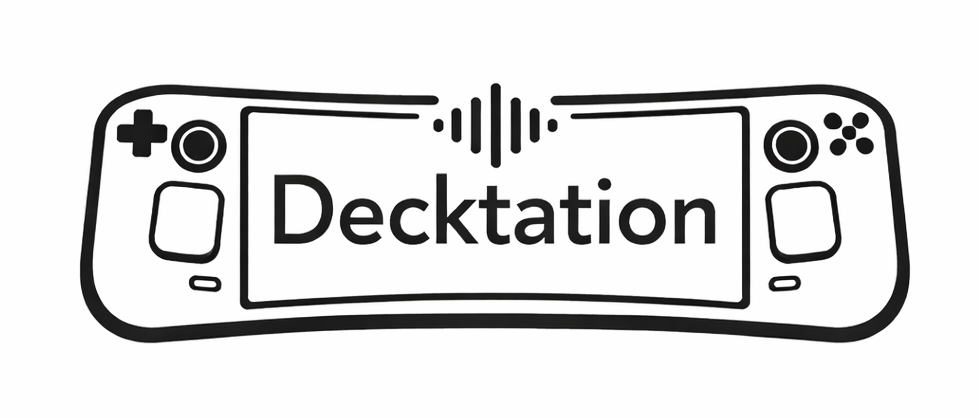

<p align="center">
  
</p>

# Decktation — Push-to-Talk Dictation for Steam Deck

Speak naturally and Decktation transcribes your words locally, then types them into the active game or app. Use it for game chat, messages, searches, and other text fields.

- Hold a configurable controller button combination to record; **L1 + R1** is the default.
- Choose a preset for World of Warcraft, Guild Wars 2, or generic text entry.
- Speak a channel prefix such as “party” to route game chat.
- Adjust the Whisper model and transcription language in the plugin.
- The optional WoW context addon can provide saved game context, but its updates are not reliably live; see [upstream issue #13](https://github.com/silverfoxy/decktation/issues/13).

## Install Decktation

Decktation requires Decky Loader. If you haven’t installed it yet, follow the [official Decky Loader installation instructions](https://github.com/SteamDeckHomebrew/decky-loader#installation) and get the installer from [decky.xyz](https://decky.xyz/), then return here.

Until Decktation is available in Decky’s official store, install its packaged release.

### Recommended: Install from URL

1. Open **Decky Settings** and enable developer options if needed.
2. Choose **Install Plugin from URL**.
3. Paste this URL and install Decktation:

   ```text
   https://silverfoxy.github.io/decktation/latest.zip
   ```

Note: Decktation won't receive automatic updates, see updating section for more information.

### Alternative: Install from a packaged ZIP

Download the [latest packaged Decktation ZIP](https://silverfoxy.github.io/decktation/latest.zip), then choose **Install Plugin from ZIP** in Decky Settings.

> **Do not install GitHub’s automatically generated “Source code (zip)” or “Source code (tar.gz)” archives.** They are not Decktation plugin packages and do not include its bundled dependencies.

### Feature branch test builds

Each Actions build uploads a packaged `decktation.zip`; downloading Actions
artifacts requires signing in to GitHub. Forks with GitHub Pages enabled also
publish branch builds at `https://<owner>.github.io/decktation/branches/<branch-slug>/decktation.zip`.
For example, `feat/settings-ux` uses `feat-settings-ux`. The Actions summary and
branch page provide the exact download link. Enable **Settings → Pages → Build
and deployment → Source → GitHub Actions** in the fork to publish previews.

### Optional / Advanced: Decktation Custom Store

The [Decktation Custom Store](doc/DECKY_STORE.md) can list Decktation in Decky’s plugin browser:

```text
https://homebrew.imsilverfoxy.com/plugins.json
```

To opt in, open **Decky Settings → General → Store Channel**, select **Custom**, and enter the URL above.

> **Important:** Decky’s Custom Store replaces the selected Default or Testing catalog; it is not added alongside the official store. While the Decktation Custom Store is selected, Decky may not detect updates for your other plugins from the official catalog. You can switch back to **Default** at any time.

Use this option only if you specifically want Decktation listed in Decky and understand the catalog trade-off. It is not the recommended permanent setting for most users.

### Updating to a new version

Installing from `latest.zip` does not enable automatic updates. Until Decktation is in the official store, update it manually:

1. Uninstall Decktation through Decky.
2. Choose **Install Plugin from URL** and paste [`latest.zip`](https://silverfoxy.github.io/decktation/latest.zip), or download it and choose **Install Plugin from ZIP**.
3. Reopen Decktation.

This replaces the plugin code; do not delete Decktation settings or downloaded Whisper models. See the [full update steps](doc/INSTALLATION.md#updating-decktation-before-it-reaches-the-official-store).

### Official Decky Store

Decktation has been [submitted to the official Decky Plugin Store](https://github.com/SteamDeckHomebrew/decky-plugin-database/pull/1126), and the request is open for review. Once listed, the official Default Store will be the preferred install and update route. Existing installations should normally receive official updates without a fresh install.

## Quick start

1. Open the Steam Deck **Quick Access Menu** (`...`) and open **Decktation**.
2. Under **Game**, choose **WoW**, **GW2**, or **Generic**.
3. Turn **Enable** on and wait for the status to show **Ready**. The first use of a model may need an internet connection to download it.
4. Select **Test Recording (3s)**, speak, and check **Last Transcription** in the panel. A test recording displays the transcript without typing it into the active app.
5. Focus the game or text field. Hold **L1 + R1**, speak, then release to transcribe and enter the text. You can change this default combination in the Decktation panel’s **Input** settings.

WoW and GW2 presets normally open game chat, add the selected channel command, and send the message; the spoken **type** channel enters text without opening chat. **Generic** also enters text directly in the focused field. See [channel and preset configuration](doc/ADVANCED_CONFIGURATION.md) for details.

## Documentation

- [Advanced configuration](doc/ADVANCED_CONFIGURATION.md): presets, spoken channel prefixes, model and language settings, and controller mappings.
- [Troubleshooting](doc/TROUBLESHOOTING.md): plugin logs, recording, controller input, and text entry.
- [WoW context guide](doc/WOW_INTEGRATION.md): setup, the current SavedVariables limitation ([issue #13](https://github.com/silverfoxy/decktation/issues/13)), and the proposed real-time companion ([issue #36](https://github.com/silverfoxy/decktation/issues/36)).
- [Development](doc/DEVELOPMENT.md): build, test, and architecture notes.
- [Privacy and permissions](doc/PRIVACY_AND_PERMISSIONS.md): diagnostic data, local processing, and Decky’s `_root` permission.
- [Installation guide](doc/INSTALLATION.md): stable release links, branch builds, and development artifacts.

## Privacy

Audio, transcripts, and WoW context are processed locally and are not uploaded. Whisper model files are downloaded from Hugging Face on first use. Optional **Diagnostics → Share** is off by default; when enabled, Decktation sends scrubbed error and performance data to Sentry. See [privacy and permissions](doc/PRIVACY_AND_PERMISSIONS.md) for what diagnostics include.

## Permissions

Decktation uses Decky’s `_root` permission to read controller inputs and type the transcript through its bundled keyboard helper. Dictated text is passed as data, never run as a command. Read the [permissions details](doc/PRIVACY_AND_PERMISSIONS.md).

## Credits and license

Built with [faster-whisper](https://github.com/guillaumekln/faster-whisper) and [Decky Loader](https://github.com/SteamDeckHomebrew/decky-loader). Decktation is licensed under the MIT License.
